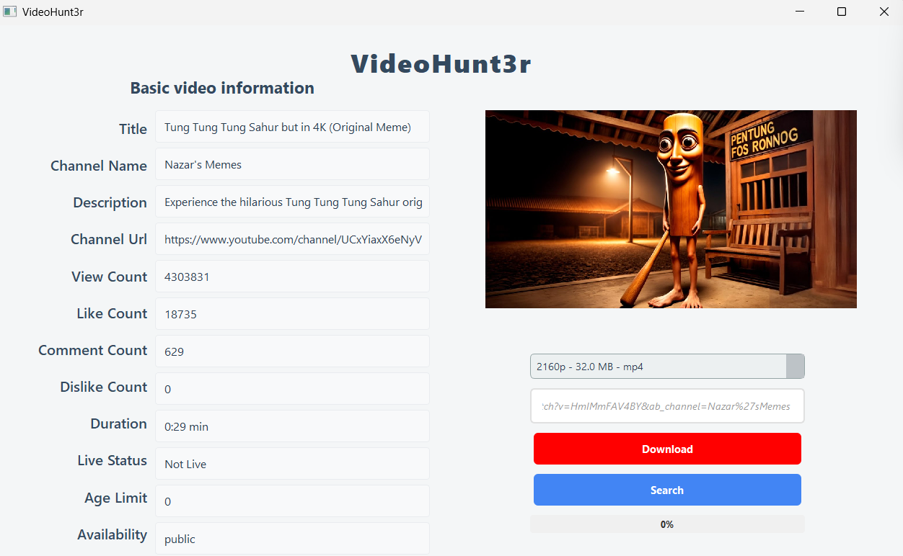

# 🎬 YouTube Downloader with PyQt5 + yt-dlp

A clean and modular YouTube downloader built using Python, PyQt5 (GUI), and yt-dlp.  
Paste a YouTube link, view metadata, and download the video in your preferred format or extract MP3 audio.

---

## 🚀 Features

- 🖥️ Intuitive PyQt5 GUI (built with Qt Designer)
- 🔗 Paste any YouTube video URL to fetch metadata
- 🎥 Download videos in resolutions from 240p to 4K
- 🎧 Download high-quality MP3 audio
- 📈 Live download progress bar
- 🧱 Clean OOP architecture with classes and threading
- ✅ MP3 conversion with FFmpeg
- 📁 Automatically saves to `downloads/` folder

---

## 🖼️ Screenshots

| GUI | 
|-----|
| 

---

## 🗂️ Project Structure

```
project-root/
├── src/
│   ├── main.py              # Main window logic
│   └── downloader.py        # Download thread logic
├── ui/
│   ├── main_window.py       # Generated from Qt Designer .ui file
│   └── panel.ui             # Original .ui file
├── screenshots/             # GUI screenshots
├── downloads/               # All downloaded files (ignored in Git)
├── .gitignore
├── requirements.txt
└── README.md
```

---

## ⚙️ Requirements

- Python 3.8+
- `yt-dlp`
- `PyQt5`
- `requests`
- FFmpeg (must be installed and in PATH)

Install all dependencies:

```bash
pip install -r requirements.txt
```

---

## ▶️ How to Run

```bash
python main.py
```

> GUI will open — paste a YouTube URL and start downloading!

---

## 🛠️ Tech Stack

- Python 3
- PyQt5
- yt-dlp
- FFmpeg
- Qt Designer

---

## 📖 Blog Post

A detailed Medium post will be published soon.  
**[Coming soon…](https://medium.com/@officialhulusi)**

---

## 📎 License

This project is licensed under the MIT License.

---

## ✍️ Author

**Mehmet Hulusi Oz**  
Python developer and computer engineering student – 2025
